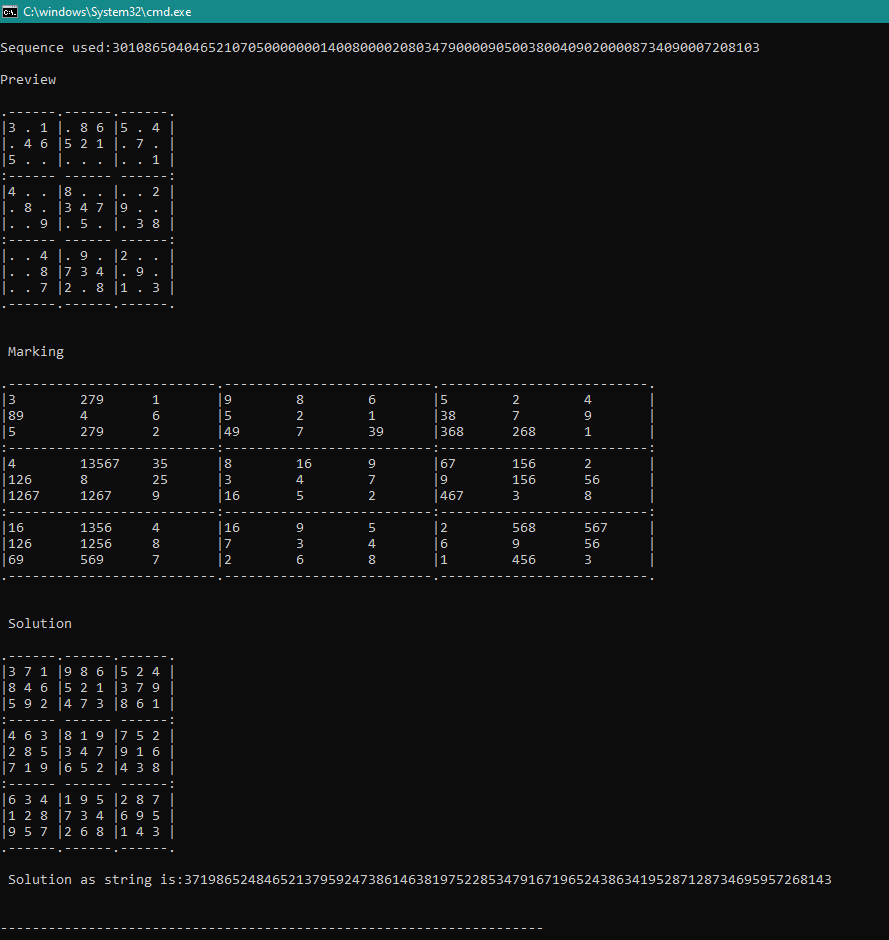

# Sudoku Game

# 🎯 Assigment 3 AGP DIT UOI

## 👩🏽‍💻 Στοιχεία

- 👩🏽 Βίννη Παναγιώτα
- 🔖 Α.Μ. 1873
- 🎓 Εξάμηνο 4ο
- 📧 penyvinni@gmail.com
- 📆 31/05/2021
- 📍 Ιωάννινα

## 📲 Connect with me

[``][facebook]

[``][instagram]

[``][twitter]

[``][linkedin]

## 📕 Περιγραφή Εργασίας

Στη συγκεκριμένη εργασία κλήθηκα να φτιάξω ένα πρόγραμμα για τη λύση 20 διαφορετικών Sudoku 9x9 σε γλώσσα Python.
Χρειάστηκε να δημιουργήσουμε αρχικά ένα αρχείο (inputdata.txt) που περιέχει και τα 20 sudokus σε μορφή κειμένου, ένα αρχείο (sudoku.py) για την ανάγνωση των 20 sudokus και την απεικόνισή του ταμπλό τους ως
κείμενο, ένα αρχείο (PencilMarks.py) για την εμφάνιση των ταμπλό με τους πιθανούς αριθμούς που μπορούν να τοποθετηθούν στις κενές θέσεις τους και ένα αρχείο (assigment.py) για την εκτέλεση όλων των αρχείων.

## 💻 Εκτέλεση Κώδικα

- python assigment.py

## 🎉 Αποτελέσματα Κώδικα

Με την εκτέλεση του κώδικα θα βγουν τα αποτελέσματα για τα 20 sudokus, όμως λόγω μεάλου αριθμού παιχνιδιών απεικονίζεται το αποτέλεσμα μόνο για 1 από αυτά: 
 

[facebook]: https://www.facebook.com/profile.php?id=100010249698503
[instagram]: https://www.instagram.com/p.vinni_/
[twitter]: https://twitter.com/peny_vn
[linkedin]: https://www.linkedin.com/in/panagiota-vinni-961265205/
